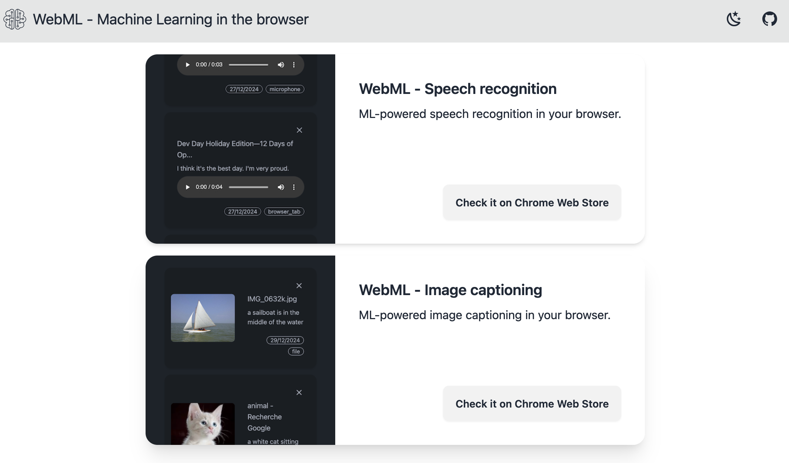

# ML-powered browser extensions

- Speech recognition

A chrome extension for speech recognition. It runs locally without sending data to a cloud service. It supports speech recognition from files, browser tab, and microphone. You can export the data from the extension.

- Image captioning

A chrome extension for image captioning. It supports image captioning from files and browser tab. You can export the data from the extension. It runs locally without sending data to an external cloud service. Once the app is initialized, the image captioning can be done without internet connexion.
